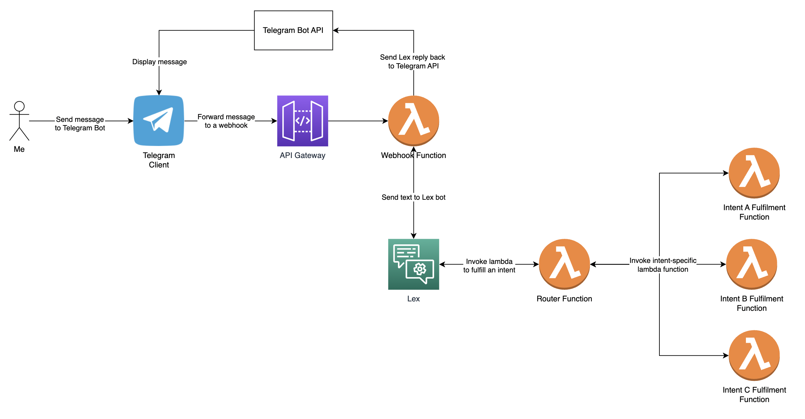
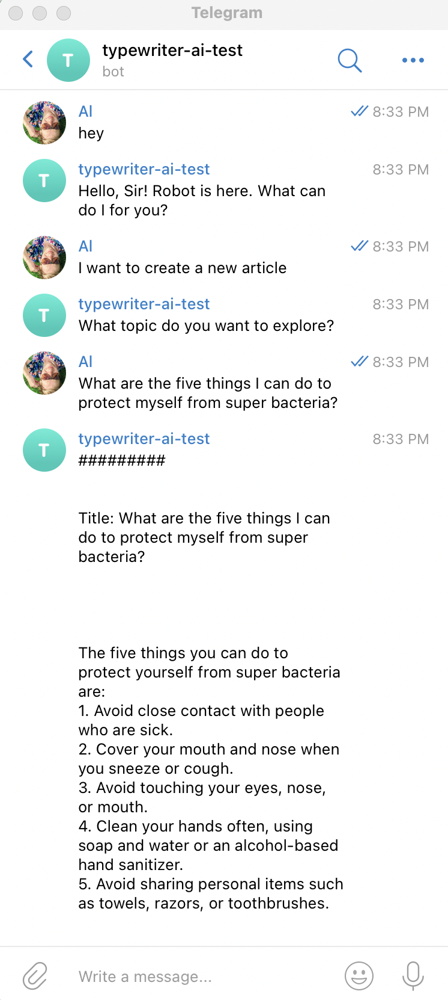

## About 🤖🦾🦿
This is my digital assistant. It's called Robot.
You can interract with Robot via Telegram messenger. It's written in Python, running on AWS and using the OpenAI API to generate answers.


## Configuring prerequisites
- Create a [Telegram Bot](https://core.telegram.org/bots#how-do-i-create-a-bot) and save API token to AWS Secrets Manager in plaintext using `TELEGRAM_TOKEN` as its name.
- Create an OpenAI API key and save this key to AWS Secrets Manager in plaintext using `OPENAI_API_KEY` as its name.
- Create two Lambda Layers with OpenAI and Requests Python libraries using this [instructions](./lambda_layer_builder/README.md)

## Deployment instructions
Each component of the Robot is deployed separately. It is designed to allow extension Robot capabilities using small increments without affecting the rest of the system.
- Lex bot is deployed via CloudFormation template.
- Integration with Telegram is done via webhook.
- Lex fulfillment function, called Router, and deployed using CDK.
- Intent-based fulfillment functions are deployed using CDK.

### Deploy Telegram webhook
We need a webhook to receive messages from Telegram.
See instructions for deploying a webhook here [telegram_webhook](./telegram_webhook/README.md).

Once the webhook is deployed, configure Telegram Bot to use it by registering the webhook URL as follows:
```
curl --request POST --url https://api.telegram.org/<TELEGRAM_TOKEN>/setWebhook --header 'content-type: application/json' --data '{"url": "<WEBHOOK_URL>"}'

Output:
{"ok":true,"result":true,"description":"Webhook was set"}
```

### Deploy Lambda Router
Lambda Router is a Lambda function that receives messages from AWS Lex and routes them to the appropriate fulfillment function. 
See instructions for deploying a Lambda Router here [router](./router/README.md).

### Deploy Lambda fullfulment functions
See instructions for deploying a Lambda fullfilment functions here [typewriter fulfillment function](./fulfillment_functions/typewrtier/README.md).


## How to use
Start a conversation with Robot by sending a message to it.




