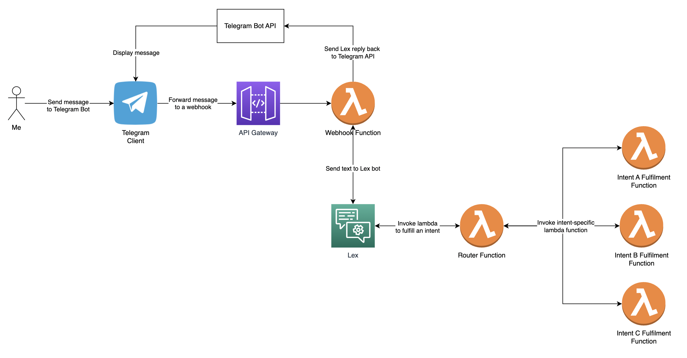

## About
This is my digital assistant. It's called Robot.
You can interract with it via Telegram. It's written in Python, running on AWS and using the OpenAI API to generate answers.


## Configuring prerequisites
- Create a [Telegram Bot](https://core.telegram.org/bots#how-do-i-create-a-bot) and get a token
- Save this token to AWS Secrets Manager in plaintext using `TELEGRAM_TOKEN` as its name.
- Create an OpenAI API key
- Create Lambda Layer with OpenAI Python and Requests libraries

## Deployment

### Deploy atelegram webhook
See instructions for deploying a webhook here [telegram_webhook](./telegram_webhook/README.md).

Once webhook deployed, configure Telegram bot to use it, by registering webhook URL as follows:
```
curl --request POST --url https://api.telegram.org/<TELEGRAM_TOKEN>/setWebhook --header 'content-type: application/json' --data '{"url": "<WEBHOOK_URL>"}'

Output:
{"ok":true,"result":true,"description":"Webhook was set"}
```

### Deploy Lambda Router
See instructions for deploying a Lambda Router here [router](./router/README.md).


## How to use