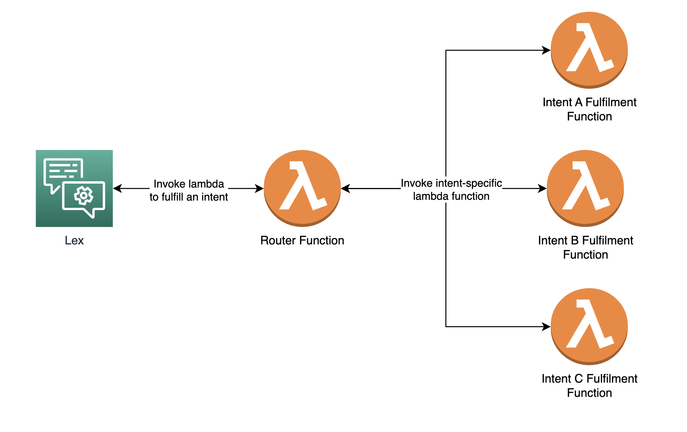

## About
This CDK project is used to deploy AWS Lambda Router Function to perform intent fulfillment for Amazon Lex bot.


## Install dependencies
```
python3 -m venv .venv
source .venv/bin/activate
pip install -r requirements.txt
```

## Deploy
```
cdk synth
cdk deploy
```

## Test
```
bash tests/test_local.sh
```

## Useful commands

 * `cdk ls`          list all stacks in the app
 * `cdk synth`       emits the synthesized CloudFormation template
 * `cdk deploy`      deploy this stack to your default AWS account/region
 * `cdk diff`        compare deployed stack with current state
 * `cdk docs`        open CDK documentation

Enjoy!
